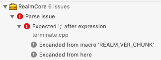
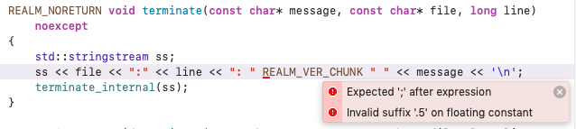
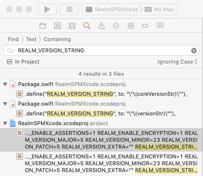
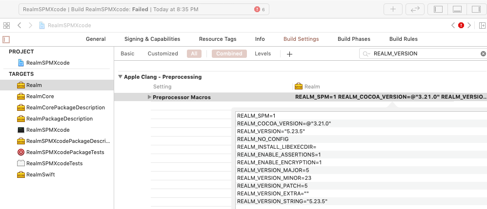
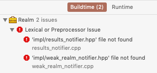
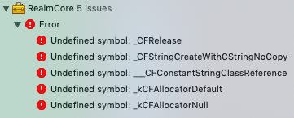

# RealmSPMXcode

**[Xcode 11] swift package generate-xcodeproj with RealmSwift dependency does not build.**

An Xcode 11 project which is generated from an executable-type Swift Package which has RealmSwift as a dependency does not build. 

Configuration:

* Xcode 11.2
* Swift 5.1.2
* macOS Mojave 10.14.6 (18G1012)

Steps:

1. Setup an executable type Swift Package with RealmSwift as a dependency.

    * Example [Package.swift](https://github.com/marc-medley/RealmSPMXcode/blob/master/Package.swift)
    * GitHub repository [`marc-medley/RealmSPMXcode` is an example Swift Package with RealmSwift as a dependency](https://github.com/marc-medley/RealmSPMXcode).

2. Verify build from the command line on has only a few warnings.

```sh
swift build

# RealmSPMXcode/.build/checkouts/realm-cocoa/Realm/RLMRealm.mm:135:17: 
# warning: method definition for 'privilegesForRealm' not found [-Wincomplete-implementation]
# @implementation RLMRealm {

# RealmSPMXcode/.build/checkouts/realm-cocoa/include/Realm/RLMRealm.h:658:1: 
# note: method 'privilegesForRealm' declared here
# - (struct RLMRealmPrivileges)privilegesForRealm;

## ... snip ...

# warnings generated.
# [139/139] Linking RealmSPMXcode
```

3. Generate an Xcode 11 project from the Swift Package.

```sh
swift package generate-xcodeproj 
# generated: ./RealmSPMXcode.xcodeproj
open RealmSPMXcode.xcodeproj/
```

4. Build in Xcode with "My Mac" as the target.








_Workaround: Edit RealmCore 5.23.5/realm/util/terminate.cpp to remove the `REALM_VER_CHUNK` expansion related error:_

``` cpp
REALM_NORETURN void terminate(const char* message, const char* file, long line) noexcept
{
    std::stringstream ss;
    // ss << file << ":" << line << ": " REALM_VER_CHUNK " " << message << '\n'; // :BEFORE:
    ss << file << ":" << line << ": [realm-core-5.23.5] " << message << '\n';    // :AFTER:
    terminate_internal(ss);
}
```

After the about workaround more errors occur:



Notice that .build/checkouts/realm-cocoa/Realm/ObjectStore/src/impl/results_notifier.hpp
and .build/checkouts/realm-cocoa/Realm/ObjectStore/src/impl/results_notifier.cpp are in the same directly.

Next attempted workaround ...

```cpp
// #include "impl/results_notifier.hpp"
#include "results_notifier.hpp"
```

... leads to yet more errors:


